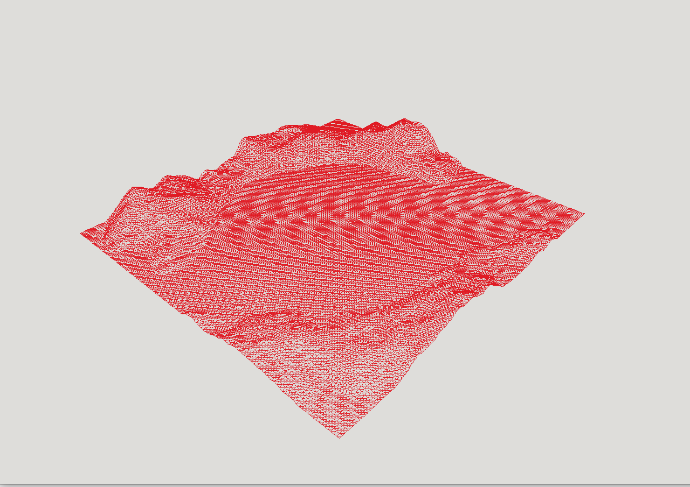
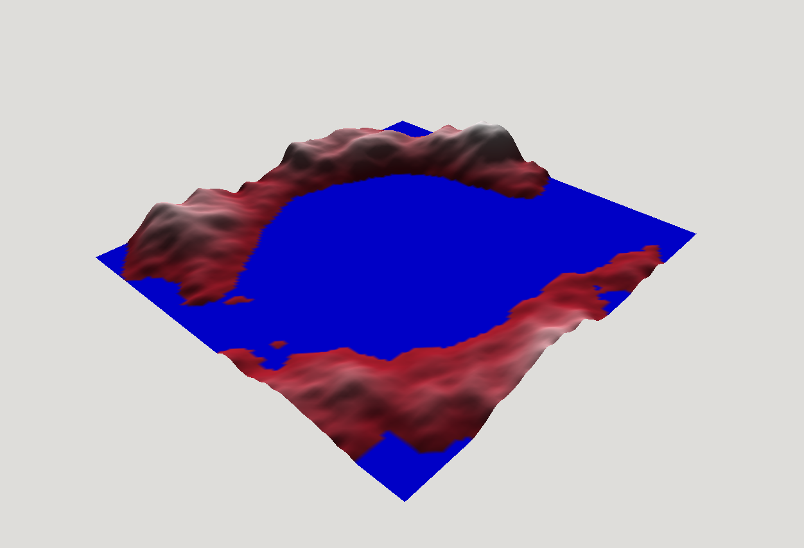
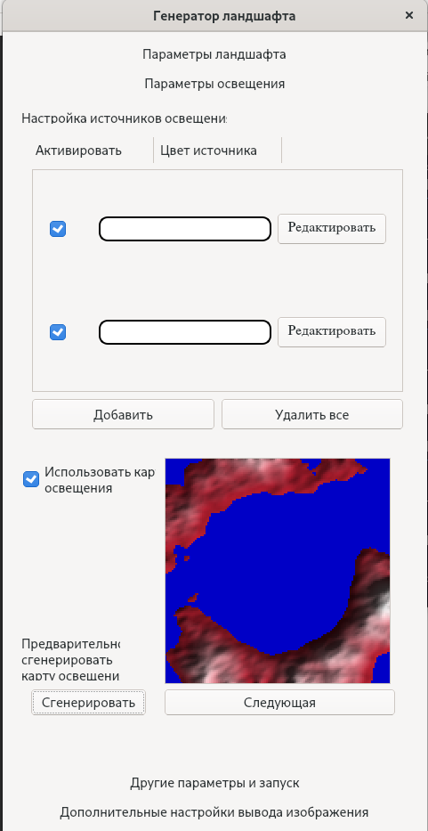
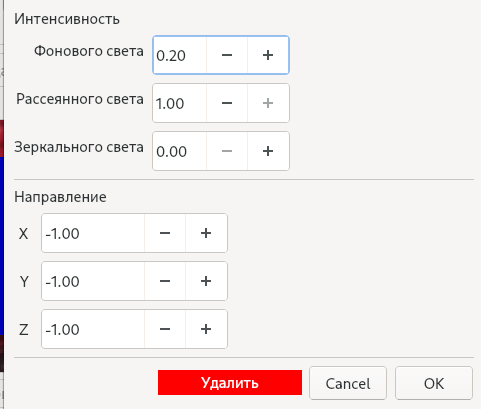
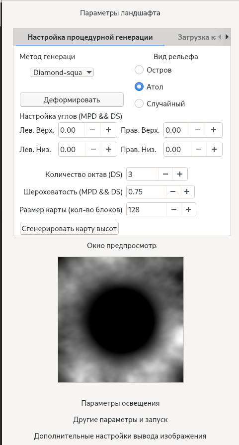
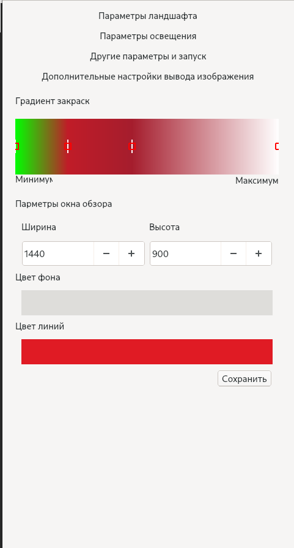

# CourseWork

Курсовая работа по машинной графике (первая самостоятельная програма)

## Описание

Программа позволяет сгенерировать матрицу высот с помощью одного из трех алгоритмов (diamond-square, шум Перлина и метод серединной точки) и отобразить ее в трехмерном пространстве.

В программе реализованы следующие алгоритмы машинной графики:
* Преобразования координат (локальные к-ты -> глобальные к-ты -> к-ты пространства камеры -> к-ты области отсечения -> экранные к-ты)
* Z-буффер
* Закраска по Гуро (в исходных текстах можно найти реализацию по Фонгу, но она "пожирает" много CPU, поэтому нет возможности указать ее)
* Отрисовка теней на основе обратных координатных преобразований
* Отрисовка на основе карты освещенностей (Предварительно сохраняется карта освещенности до открытия окна просмотра. В процессе отрисовки ландшафта освещенность каждой вершины не расчитывается, а используются значения карты освещеннсти (RGB-модель), над которыми выполняется интерполяция)

Пользователю доступен выбор параметров генерации карты высот, параметров источников света, цвета ландшафта и выбор объема просмотра (clipping space matrix).

Пользователь имеет возможность перемещаться по пространству, но ему требуется выделить основное окно, а не viewport. Это связано с тем, что я не мог разобраться, как отрисовать кадровый буфер с помощью API OpenGL от Qt, поэтому решил использовать glfw, чтобы его отрисовывать. Я не разобрался, как связать позицию мышки, предоставляемую glfw, с Qt, поэтому требуется выделить основное окно,чтобы иметь возможность перемещаться. Использование glfw к тому же потребовало преобразования целочисленных значений в числа с плавающей запятой (основное бутылочное горлышко реализованного конвейера отрисовки), поэтому отрисовка кадров "медленная".

## Зависимости

* CMake
* qt5
* glew
* glfw
* google-test

## Запуск

Программа:

```sh
cd coursework
mkdir build && cd build
cmake ..
cmake --build .
```

Модульные тесты:

```sh
cd coursework/tests
mkdir build && cd build
cmake ..
cmake --build .
```

## Скрины запущенной программы

Каркасная модель



Закраска по Гуро



Настройка освещенности (1)



Настройка освещенности (2)



Параметры синтезируемого ландшафта (2)



Настройка закраски, теней и проекции


Параметры окна предпросмотра и закраска поверхности (да, параметры ландшафта смешены с параметрами экрана, я этот момент не продумал)


